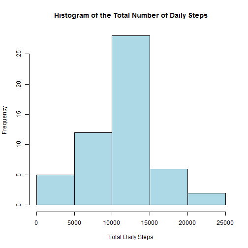
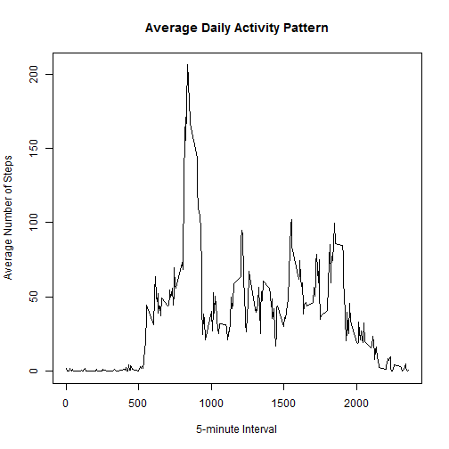
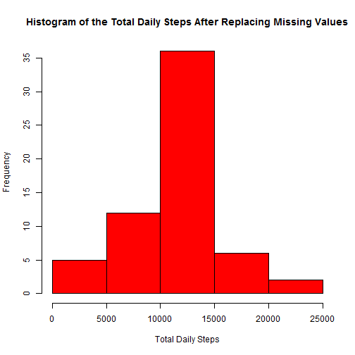
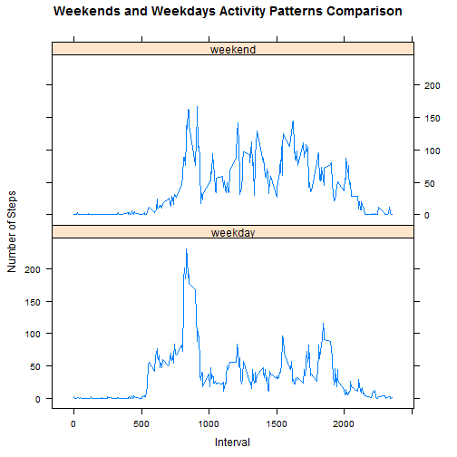

## Loading and preprocessing the data

```r
# Loading and preprocessing the data, given that it is available in your working directory.
activity <- read.csv("activity.csv")
head(activity)
```

```
##   steps       date interval
## 1    NA 2012-10-01        0
## 2    NA 2012-10-01        5
## 3    NA 2012-10-01       10
## 4    NA 2012-10-01       15
## 5    NA 2012-10-01       20
## 6    NA 2012-10-01       25
```


## What is mean total number of steps taken per day?

```r
# Calculating the total number of steps taken per day while ignoring the missing values.
# First subsetting the data.
total_steps <- aggregate(steps ~ date, data = activity, sum)
    
# Making a hitogram of the number of steps taken each day.
hist(total_steps$steps, col="lightblue", xlab="Total Daily Steps",
main="Histogram of the Total Number of Daily Steps")
```

 

```r
# Computing the mean and the median of the total number of steps taken per day.
# Used the "summary" function to verify the answers provided my "mean" and "median".
# If you obtain different results, set options(digits=12)
mean_steps <- mean(total_steps$steps)
median_steps <- median(total_steps$steps)
summary(total_steps$steps)
```

```
##    Min. 1st Qu.  Median    Mean 3rd Qu.    Max. 
##      41    8841   10760   10770   13290   21190
```
The mean of the total number of steps taken per day is **1.0766189 &times; 10<sup>4</sup>** and median is **10765**.


## What is the average daily activity pattern?

```r
# Making a time series plot (i.e. type = "l") of the 5-minute interval (x-axis) and 
# the average number of steps taken, averaged across all days (y-axis)
avg_steps <- aggregate(steps ~ interval, data = activity, mean)
plot(avg_steps$steps ~ avg_steps$interval, type="l", xlab="5-minute Interval",
     ylab="Average Number of Steps", main="Average Daily Activity Pattern")
```

 

```r
# Extracting the 5-minute interval that contains the maximum number of steps on average.
max_interval <- avg_steps$interval[which.max(avg_steps$steps)]
```

The 5-minute interval that contains the maximum number of steps on average across 
all the days in the dataset is the interval starting at **835**.


## Imputing missing values

```r
# Calculating the total number of missing values (NAs) in the dataset. 
sum(is.na(activity)) #or
```

```
## [1] 2304
```

```r
summary(activity)
```

```
##      steps                date          interval     
##  Min.   :  0.00   2012-10-01:  288   Min.   :   0.0  
##  1st Qu.:  0.00   2012-10-02:  288   1st Qu.: 588.8  
##  Median :  0.00   2012-10-03:  288   Median :1177.5  
##  Mean   : 37.38   2012-10-04:  288   Mean   :1177.5  
##  3rd Qu.: 12.00   2012-10-05:  288   3rd Qu.:1766.2  
##  Max.   :806.00   2012-10-06:  288   Max.   :2355.0  
##  NA's   :2304     (Other)   :15840
```

```r
# Devising a strategy for filling in all of the missing values in the dataset.
# Filling the missing values with the mean of the steps in the corresponding 5-minutes interval.
# tapply(X = Summary Variable, INDEX = Group Variable, FUN = Function)
na_loc <- which(is.na(activity$steps))
steps <- activity$steps
steps[na_loc] <- ceiling(tapply(activity$steps, activity$interval, mean, na.rm=TRUE))

# Creating a new dataset equal to the original dataset but with the missing data filled in.
new_activity_data <- cbind(steps, activity[,2:3])

# Making a histogram of the total number of steps taken each day. 
new_total_steps <- aggregate(steps ~ date, data = new_activity_data, sum)
hist(new_total_steps$steps, col="red", xlab="Total Daily Steps",
     main="Histogram of the Total Daily Steps After Replacing Missing Values")
```

 

```r
# Computing the mean and median total number of steps taken per day. 
new_mean_steps <- mean(new_total_steps$steps)
new_median_steps <- median(new_total_steps$steps)
summary(new_total_steps$steps)
```

```
##    Min. 1st Qu.  Median    Mean 3rd Qu.    Max. 
##      41    9819   10910   10780   12810   21190
```

```r
# Impact of imputing missing data on the estimates of the total daily number of steps.
mean_impact <- new_mean_steps - mean_steps
median_impact <- new_median_steps - median_steps
```

The impact of substituting the missing data by the estimates of the average daily number of steps is
that there is an increase in the values of the mean and the median. In fact, the mean increased by
**18.7293535** and the median increased by **144**.


## Are there differences in activity patterns between weekdays and weekends?

```r
# Create a new factor variable in the dataset with two levels – “weekday” and “weekend” 
# indicating whether a given date is a weekday or weekend day.
# Converting the dates from factor to date object
dates <- as.Date(new_activity_data$date, "%Y-%m-%d")
# Creating a new variable "dayofweek" in the dataset
new_activity_data['dayofweek'] <- weekdays(dates)
# Replacing the data in "dayofweek" with corresponding tag: weekday or weekend
new_activity_data$dayofweek[new_activity_data$dayofweek %in% c('Saturday','Sunday')] <- "weekend"
new_activity_data$dayofweek[!(new_activity_data$dayofweek %in% c('weekend'))] <- "weekday"

# Computing the average steps
new_avg_steps <- aggregate(steps ~ interval + dayofweek, data = new_activity_data, mean)

# Making a panel plot of both weekend and weekday graphs.
library("lattice")
xyplot(steps ~ interval | dayofweek, type="l", data=new_avg_steps, xlab="Interval", 
ylab="Number of Steps", layout=c(1,2), main="Weekends and Weekdays Activity Patterns Comparison")
```

 

The activity patterns for both weekdays and weekends seem to follow almost the same trend but 
there exist differences between them. This can be seen from the **"Weekends and Weekdays Activity Patterns Comparison"**
graph that is plotted above. 

